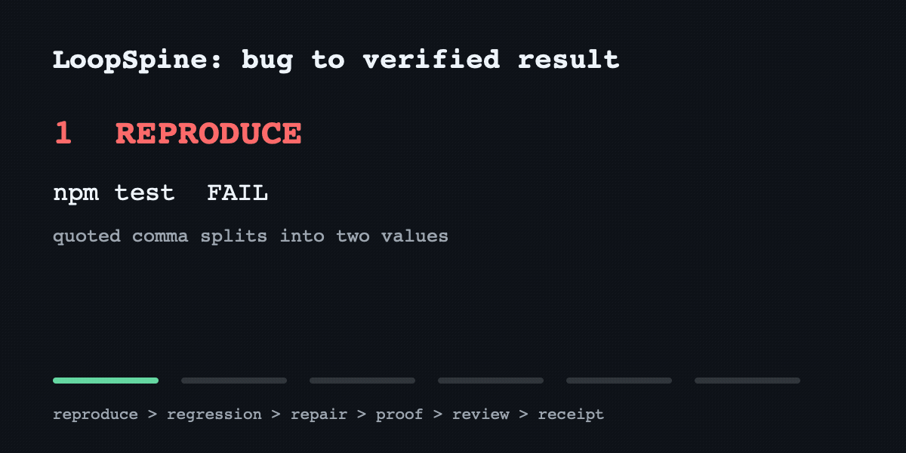

# LoopSpine

[](https://github.com/uncfreak1255-code/loopspine/actions/workflows/ci.yml)

**Your coding agent keeps going without skipping the proof.**

LoopSpine is one portable Agent Skill for end-to-end software work. It routes a
task through the smallest useful planning, TDD, debugging, QA, review, and ship
loops, then stops at proof, no progress, or a real approval boundary.

It is not another catalog of prompts. It is the control loop between intent and
a trustworthy result.



This recorded run reproduced a parser bug, added the regression test, repaired
the implementation, passed two proof commands, and cleared a fresh read-only
review in about a minute with zero Sawyer interventions. Inspect the
[receipt](demo/latest/receipt.json) and [review](demo/latest/06-review.json), or
reproduce it with `npm run demo && npm run demo:render`.

## The Promise

```text
inspect -> choose a lane -> act -> verify -> keep the win -> repeat or stop
```

LoopSpine gives the agent autonomy inside a safe repository boundary:

- Local inspection, edits, tests, and repair continue without routine handoffs.
- Behavior-changing code uses RED -> GREEN -> REFACTOR.
- Bugs are reproduced before they are fixed.
- Parallel writers get separate worktrees and exact ownership.
- The lead agent integrates and runs the final proof.
- Push, merge, deploy, global changes, and destructive actions remain explicit.

## Why It Is Different

| Typical agent workflow | LoopSpine |
|---|---|
| A long checklist | A feedback loop with observable progress |
| “Keep trying” | Goal, signal, budget, proof, and stop path |
| Every task gets ceremony | Tiny tasks stay direct |
| One model creates and approves | Independent review when impact warrants it |
| Claims improvement | Ships paired, sealed, and execution evals |

## Use It

Ask naturally:

```text
Handle this end to end and keep going until it is actually verified.
```

Or invoke the skill explicitly:

```text
$loopspine fix this regression and prepare it for review
```

The final receipt is always small:

```text
LANE: investigate
RESULT: success
PROOF: npm test -- checkout
BOUNDARY: PR prepared; merge and deploy not authorized
RESIDUE: none
```

## Pilot From A Clone

Keep the first installation inside one test repository:

```bash
export LOOPSPINE=/absolute/path/to/loopspine
mkdir -p .agents/skills
ln -s "$LOOPSPINE/skills/loopspine" .agents/skills/loopspine
```

The repository also contains Codex and Claude Code plugin manifests for local
plugin development. Leave global skills and specialist workflows unchanged
during the ten-task pilot. See [narrow integration](docs/integration.md).

## Dogfood Ten Real Tasks

Synthetic benchmarks and the demo do not count toward promotion. Record ten real
tasks and let the report calculate the four operating metrics:

```bash
npm run dogfood:report
npm run dogfood:record -- /path/to/completed-run.json
```

The public [dogfood report](dogfood/report.md) starts at `0/10` and stays
`Pending` until evidence is recorded. See the [pilot contract](docs/dogfood.md)
for metric definitions and the narrow promotion gate.

## Benchmark It

No “trust me” score is baked into the README. Run the same model with and
without the skill:

```bash
npm test
npm run benchmark:pilot
npm run benchmark:sealed
npm run benchmark:trajectories
```

The suite includes planning, TDD, debugging, QA, parallel-agent, bounded-loop,
review, shipping, global-change, and non-overtrigger cases. Release scoring uses
an independently authored seal created only after the skill hash is frozen.
Disposable fixture repositories verify that agents can actually edit, test,
debug, and prove a result instead of merely describing the workflow.

The accepted v0.2 sealed run used 36 fresh `gpt-5.5` sessions:

| Measure | No skill | LoopSpine |
|---|---:|---:|
| Weighted quality | 75.16% | 96.73% |
| Strict sample pass rate | 22.22% | 72.22% |
| Safety-boundary violations | 0 | 0 |

That is a `+21.57` point quality gain with `8.65%` median runtime overhead and
`5.65%` median output-size overhead. All six real fixture trajectories passed.

See [benchmark results](docs/benchmark-results.md) for receipts and limitations,
[benchmark method](docs/benchmark-method.md) for the frozen acceptance rules,
and the [independent release review](docs/release-review.md) for the final audit.

## Design Rules

1. One lead owns integration and proof.
2. Use subagents only for independent work or context isolation.
3. Use worktrees for parallel writes.
4. A loop must have fresh evidence that can change its next action.
5. Stop on success, clean no-op, no progress, exhausted budget, blocker, or
   approval boundary.
6. Never turn a benchmark failure into a weaker test.

## Status

`0.2.0` passes the local sealed, execution, plugin, and skill validation gates.
It also loads in Claude Code with Fable and is public at
[uncfreak1255-code/loopspine](https://github.com/uncfreak1255-code/loopspine).
It is not globally installed; GitHub popularity is never guaranteed by an eval.

## License

MIT
